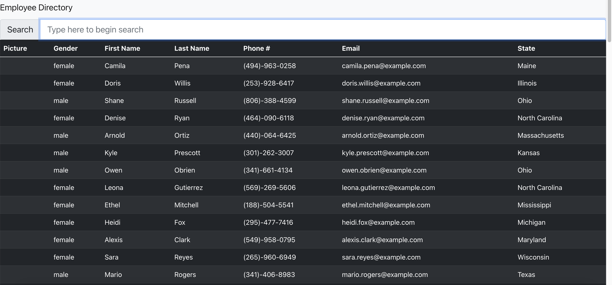

# employee-directory

## Overview

For this assignment, you'll create a employee directory with React. This assignment will require you to break up your application's UI into components, manage component state, and respond to user events.

## User Story

* AS A user, I want to be able to view my entire employee directory at once,  
* SO THAT I have quick access to their information.

## Business Context

An employee or manager would benefit greatly from being able to view non-sensitive data about other employees. It would be particularly helpful to be able to filter employees by name.

## Acceptance Criteria

Given a table of random users generated from the [Random User API](https://randomuser.me/), when the user loads the page, a table of employees should render. 

The user should be able to:
  * Sort the table by at least one category
  * Filter the users by at least one property.

## Screenshot

## Deploying the Application

This app should be deployed to GitHub Pages using Create React App docs.
* **Important**: Be sure to push your codebase to GitHub and **NOT** your built and deployed code. Ensure this happens by following the above instructions and using the `gh-pages` branch to host the deployed application's code.

***

URL to Deployed Application: X

https://github.com/tracy80s2003/employee-directory

https://tracy80s2003.github.io/employee-directory/